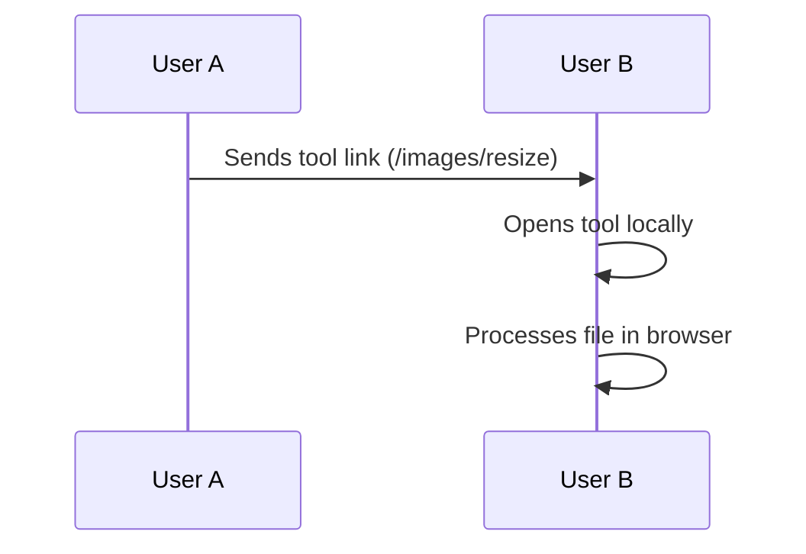
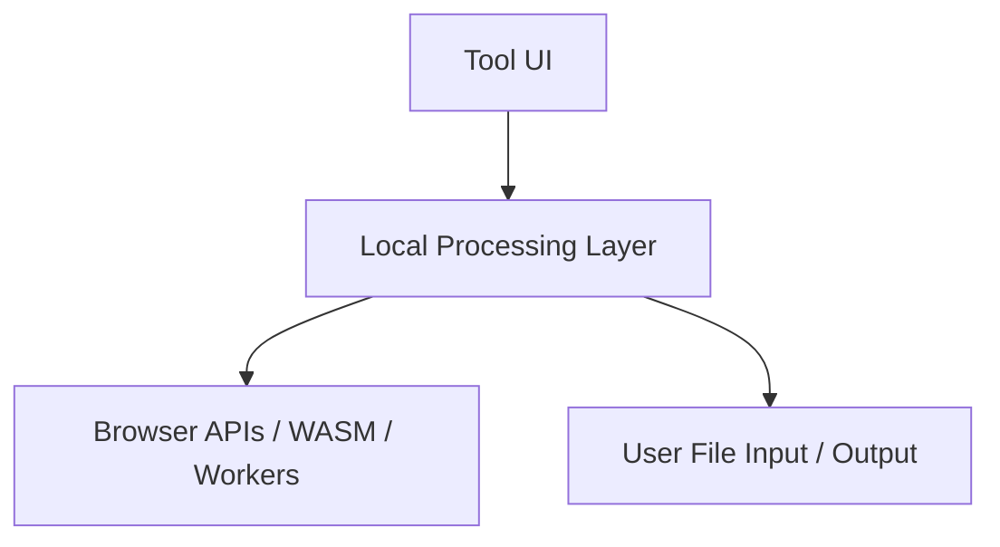

# runlocal.tools

**Open tools. Local execution. No unnecessary trust.**

runlocal.tools is an open, local-first toolbox for everyday file and media tasks — running entirely in the browser.

It enables users to process files (images, data, video) without uploading them to external servers.

---

## ✨ Overview

Most online utility tools today are:

* cluttered with ads
* dependent on server-side processing
* opaque in how they handle user data

runlocal.tools takes a different approach:

* 🖥️ **Runs locally in the browser**
* 🔐 **No file uploads required**
* 🧩 **Composable by design**
* 🔗 **Shareable via simple URLs**
* 🌍 **Open source and reusable**

---

## 🧠 Core Idea

Instead of sending files to tools, you bring tools to your files.

Each tool is accessible via a stable URL:

```
/images/resize  
/images/convert  
/csv/to-json  
/json/to-csv
```

You open a link, drop a file, and the processing happens locally — on your device.

---

## 🔄 How it works


No uploads.
No round-trips.
No external processing.

---

## 🔗 Share tools, not files

Instead of uploading and forwarding files, users can share the tool itself.



This removes friction and avoids unnecessary data transfer.

---

## 🧩 Composable by design

runlocal.tools is not just a collection of isolated utilities.

It is designed to evolve into a system where tools can be combined.


Inspired by Unix pipelines — but adapted to the browser.

---

## 🏗️ Architecture (high-level)



* No backend required for core functionality
* Processing happens via browser APIs, Web Workers, and WASM
* Shared logic across tools enables consistency and reuse

---

## 🧰 Tool Categories

### Image tools

* Resize
* Convert (PNG, JPG, WebP, etc.)
* Compress
* Crop

### Data tools

* CSV ↔ JSON
* Formatting
* Validation
* Inspection

### Video tools *(planned)*

* Trim
* Convert
* Compress

---

## 🌍 Why this matters

Everyday file tasks should not require blind trust.

Uploading personal files to unknown services has become normal — but it is often unnecessary.

Modern browsers are capable of handling many of these tasks locally.

runlocal.tools is built on a simple principle:

> Users should stay in control of their data.

---

## 🔓 Open Source

runlocal.tools is developed as an open project:

* Fully inspectable source code
* Reusable components
* Designed for extension and contribution
* Self-hostable

This is not a closed service — it is shared infrastructure.

---

## 🏛️ Digital Commons

runlocal.tools is intended as public digital infrastructure.

It contributes to a healthier web by:

* reducing unnecessary data transfer
* avoiding centralized processing dependencies
* enabling transparent and verifiable tools
* providing reusable building blocks

Simple utilities should be part of the commons — not locked behind ads and tracking.

---

## 🛣️ Roadmap

Short-term:

* Core image tools (resize, convert, compress)
* CSV ↔ JSON tools
* Shared UI and processing patterns

Mid-term:

* Expand tool coverage (video, more data tools)
* Build a shared local processing layer
* Improve performance and UX

Long-term:

* Composable workflows between tools
* Local-first automation layer
* Optional local AI-assisted processing

---

## ⚙️ Technical Principles

* Local-first execution
* Minimal dependencies
* Progressive enhancement
* Works offline after initial load (PWA-ready)
* Accessible and performant

---

## 🤝 Contributing

Contributions are welcome.

Areas of interest:

* new tools
* performance improvements
* UI/UX refinements
* documentation

---

## 📄 License

(To be defined — recommend MIT or Apache 2.0)

---

## 💬 Summary

runlocal.tools rethinks how simple tools should work on the web:

* local instead of remote
* transparent instead of opaque
* composable instead of isolated

A universal toolbox for everyday tasks — running where your data already is.

