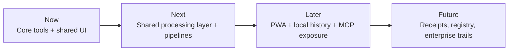
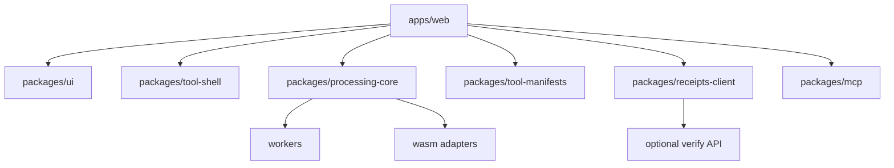

# Produktstrategie für runlocal.tools

## Executive Summary

`runlocal.tools` hat bereits einen klaren, seltenen und wertvollen Kern: **browser-native, lokale Datei- und Medienverarbeitung ohne Upload**, mit stabilen Tool-URLs und einem optionalen Verifizierungs- beziehungsweise Receipt-Layer. Die öffentliche Substanz ist heute noch klein, aber sie ist nicht beliebig: Das Repository beschreibt lokale Verarbeitung im Browser, wiederverwendbare Primitives, Self-Hosting und „digital commons“; live sind mindestens **Image Merge**, **Strip Metadata**, **CSV to JSON**, eine **Receipt-Verifikation** und eine kleine **Tool-Metadaten-API**. GitHub zeigt ein sehr frühes Stadium mit **45 Commits**, **HTML 100%**, **keinen Releases**, **keiner festgelegten Lizenz** und einer statischen Struktur rund um `index.html`, `images/merge`, `images/strip-metadata` und `data/csv-to-json`. citeturn1view0turn4view0turn14view0turn14view1turn8view0turn10view0turn13view0turn13view1

Das wichtigste strategische Signal ist nicht „mehr Features“, sondern **Schärfe**. Der Markt ist bereits dicht besetzt bei lokalen Modell-Runnern und AI-Workspaces: **LM Studio**, **Ollama**, **LocalAI**, **Open WebUI**, **Jan** und **AnythingLLM** besetzen den Raum „lokale Modelle / Self-hosted AI-Plattform“; **Cursor**, **Warp**, **OpenHands** und **Continue** besetzen „agentisches Coding“; **n8n** besetzt „sichtbare Workflows und Automationen“; **Bolt** und **Lovable** besetzen „chat-to-app building“. `runlocal.tools` sollte deshalb **nicht** wie ein weiterer lokaler LLM-Hub oder Vibe-Coding-Builder positioniert werden, sondern als **das elegante, privacy-first Werkzeug-Atelier für private Datei-Arbeit im Browser** – mit optionalen, bezahlbaren Proofs für Agents. Genau diese Kombination ist in den offiziellen Positionierungen der genannten Anbieter nicht ihr Kernversprechen. citeturn16search0turn16search1turn16search2turn16search15turn17search0turn17search1turn17search2turn17search3turn18search1turn18search2turn15search10turn15search9turn18search4

Die zentrale Empfehlung lautet deshalb: **Runlocal als Produkt nicht um AI-Chat herum bauen, sondern um private, vertrauenswürdige, URL-adressierbare Browser-Werkzeuge.** AI, MCP und x402 sind wertvoll, aber als **sekundäre Schichten**. Das Hauptversprechen muss lauten: *„Open the tool, not the transfer workflow.“* Der sekundäre Satz lautet: *„Verify when it matters.“* Diese Priorisierung passt sowohl zur README-These als auch zum Live-Produkt, verhindert Positionierungsverwässerung und schafft eine deutlich verständlichere Marke als die aktuelle Mischform aus Privacy-Toolbox und Agent-Commerce-Demo. citeturn1view0turn12view0turn7view0turn20search5turn20search12

## Analyse des Repositories und der Produktsubstanz

### Was heute sichtbar ist

Die im Repository und auf den Live-Seiten klar bestätigten Produktbausteine sind vergleichsweise schlicht, aber bereits belastbar genug, um eine echte Produktstrategie darauf aufzubauen. Das README beschreibt `runlocal.tools` als **„Local-first browser tools for file and media processing“** und betont ausdrücklich: lokale Verarbeitung im Browser, keine Uploads, sharebare Routen wie `/images/resize` oder `/csv/to-json`, wiederverwendbare Primitives, Progressive Enhancement, PWA-Readiness, Self-Hosting und Open-Source-/Commons-Orientierung. Gleichzeitig nennt das README aber die Lizenz noch **„Not specified yet“**, was für ein angeblich offenes, wiederverwendbares Grundlagenprojekt ein unmittelbar lösbarer Vertrauens- und Adoptionsblocker ist. GitHub zeigt außerdem keine Releases und HTML als einzige erkannte Sprache. citeturn1view0

Auf der ausgelieferten Produktoberfläche sind heute mindestens drei Nutzerwerkzeuge sichtbar: **Image Merge**, **Strip Metadata** und **CSV to JSON**. Hinzu kommt eine **Verification UI** und eine **Tool Metadata API** für `image-merge`; die neuere Live-Homepage ergänzt außerdem das Narrativ „humans use tools for free, agents optionally pay for verifiable execution receipts“, inklusive Hinweis auf **x402** und **Algorand TestNet**. Das ist strategisch interessant, aber zugleich ein Signal dafür, dass das Produkt aktuell zwischen zwei Storys schwankt: „digitale Allmende für private Datei-Arbeit“ und „monetarisierbarer Agent-Proof-Layer“. citeturn12view0turn7view0turn8view0turn10view1turn13view2

Bei den einzelnen Tools ist die Grundhaltung sauber: **lokal, explizit, verständlich**. `Strip Metadata` erklärt präzise, dass nur eingebettete Metadaten entfernt werden und das sichtbare Bild darüber hinaus nicht transformiert wird; `CSV to JSON` erlaubt Paste oder Dateiinput, Delimiter-Wahl und Export ohne Server-Upload; `Image Merge` ist bewusst eng auf einen verständlichen Merge-Workflow reduziert. Das ist ein guter Anfang, weil das Produkt damit nicht „alles“ verspricht, sondern kleine, vertrauenswürdige Einheiten. citeturn13view0turn13view1turn10view0

### Die stärkste These des Produkts

Der beste Satz im gesamten Projekt ist nicht technisch, sondern konzeptionell: **„Share tools, not files.“** Das ist deutlich stärker als „local AI“ oder „privacy-first“, weil es die Produktmechanik in eine kulturelle und arbeitspraktische Form übersetzt. Menschen teilen heute häufig Workflows, indem sie Dateien erst hochladen, dann verarbeiten, dann wieder herunterladen. `runlocal.tools` dreht das um: Es teilt **Capability-URLs** statt Datenpfade. Diese Richtung ist sowohl im README als auch in der Live-Seite konsistent angelegt und sollte die eigentliche Weltanschauung des Produkts werden. citeturn1view0turn12view0

Die zweite starke These ist **Composability**. Das README und die öffentlich indexierte Produktseite sprechen von fokussierten Tools, Outputs als Inputs und einer Browser-Adaption des Unix-Pipe-Gedankens. Diese Idee ist deutlich größer als einzelne Tools. Sie weist auf ein potenzielles Betriebssystem-Muster hin: nicht „eine große Web-App“, sondern ein **adressierbares lokales Werkzeugnetz**. Das ist deutlich differenzierter als die meisten Privacy-Tools, die entweder einzelne Konverter sind oder in generischen „AI workspaces“ enden. citeturn1view0turn12view0

### Was im aktuellen Zustand noch fehlt

Drei Lücken sind aus Produktsicht sofort kritisch. Erstens fehlt eine **saubere offene Lizenz**, obwohl Offenheit, Reuse und Self-Hosting bereits zur öffentlichen Story gehören. Zweitens ist die Architektur nach außen hin noch sehr **route-by-route und HTML-zentriert**, was für einen Prototypen gut, für systematische Erweiterbarkeit aber riskant ist; das Repo zeigt heute vor allem statische HTML-Seiten statt eines klar erkennbaren Shared-Core für Upload, Preview, Transform, Export und Receipts. Drittens ist das Messaging auf der Oberfläche noch nicht stabil: Die indexierte Version der Site betont „Local-first browser tools“ und Commons; die aktuell direkt geöffnete Homepage rückt „verifiable receipts“ und „agentic commerce“ deutlich stärker nach vorn. Diese Drift ist für Menschen noch reparabel, für Agenten und Contributor aber verwirrend. citeturn1view0turn12view0turn7view0

Meine Schlussfolgerung daraus ist klar: **Das Produkt hat bereits eine gute Wedge, aber noch kein ausformuliertes Betriebssystem.** Genau deshalb braucht es nicht nur Design, sondern Dokumente, North Star, Shared Primitives, Manifeste, Roadmap und Agent-Guide.

## Marktbild, Trends und Differenzierung

### Wo der Markt heute bereits besetzt ist

Der lokale-AI- und agentische Produktmarkt ist 2026 in mehrere klar lesbare Kategorien zerfallen. **LM Studio** positioniert sich als lokale und private Plattform zum Entdecken, Herunterladen und Ausführen von Modellen auf dem eigenen Rechner; **Ollama** ist die schlanke lokale Laufzeit- und Integrationsschicht für Open-Model-Apps und Agents; **LocalAI** setzt auf OpenAI-/Anthropic-kompatible lokale APIs und einen composable Stack; **Open WebUI**, **Jan** und **AnythingLLM** gehen in Richtung Self-hosted AI-Interface, Team-Workspaces, RAG und Agent-Funktionen. Diese Produkte konkurrieren um „dein lokales AI-Zentrum“. `runlocal.tools` sollte sich nicht in diesen roten Ozean hineinpositionieren. citeturn16search0turn17search0turn17search9turn16search5turn16search6turn16search15

Auf der Coding-Seite ist die Lage ähnlich eindeutig. **Cursor** positioniert sich als Coding Agent und baut Agent-Workflows, Skills, Rules, MCP und Team-Marktplätze aus; **Warp** beschreibt sich inzwischen explizit als „Agentic Development Environment“ mit Agent-Orchestrierung; **OpenHands** ist auf autonome Softwareentwicklungs-Agenten ausgelegt; **Continue** beschreibt sich als Open-Source-Coding-Agent für CLI und IDE. Wer in dieser Kategorie gewinnt, gewinnt über Code-Kontext, Git, IDE-Integration und Agentensteuerung. `runlocal.tools` hat heute weder die Produkt-DNA noch die glaubwürdige Ausgangsbasis, um diese Front anzugreifen. citeturn15search10turn15search14turn15search18turn15search9turn15search21turn17search3turn17search23turn18search4turn18search16

Dazu kommt eine dritte Klasse: **n8n** als sichtbare Workflow- und Automationsschicht, **Bolt** und **Lovable** als „chat-to-app“-Builder. Auch das ist nicht der richtige Primärmarkt für Runlocal. Diese Produkte verkaufen Geschwindigkeit in der Erstellung neuer Software oder Automationen; `runlocal.tools` verkauft dagegen Vertrauen, Direktheit, Privatheit und konkrete Alltagsarbeit an vorhandenen Dateien. citeturn17search2turn17search14turn18search1turn18search2turn18search5

### Was Runlocal davon trotzdem lernen sollte

Aus **Raycast** kommt die Lektion **Commandability**: eine Sammlung kleiner, leistungsfähiger, schneller Fähigkeiten in einem kohärenten Surface. Aus **Linear** kommt die Lektion **Tempo, Fokus, reduzierte Reibung und agentische Workflows ohne visuelle Lautstärke**. Aus **Vercel** kommt die Lektion **produktisierte Infrastruktur, starke Defaults und exzellente DX**. Aus **Superhuman** kommt die Lektion **Gefühl von Geschwindigkeit als Produktwert**. Aus **Arc** kommt die Lektion **ruhige, persönlichere, anti-chaotische Browser-UX**. Keine dieser Marken ist ein direkter Produktzwilling zu Runlocal, aber alle sind wertvolle Referenzen für Interaktion, Copy, Performance-Gefühl und Premium-Wahrnehmung. citeturn22search2turn19search0turn19search12turn18search11turn18search7turn19search1turn19search5turn19search2turn19search6

Aus **Claude Desktop**, MCP und x402 kommt eine andere Lektion: Tooling und Runtimes werden zunehmend **agent-fähig**, standardisiert und monetarisierbar. Anthropic hat MCP als offenen Standard für die Verbindung von AI-Systemen mit Tools und Datenquellen positioniert; Claude Desktop erleichtert lokale MCP-Nutzung und Extensions; x402 bildet einen HTTP-basierten Standard für programmatische Zahlungen. Das ist für `runlocal.tools` relevant – aber eben als **zweite Etage**. Erst wenn das lokale Tool überzeugt, lohnt sich der Proof- und Payment-Layer. citeturn23search2turn23search0turn23search3turn20search5turn20search17

### Der eigentliche White Space

Der White Space ist daher nicht „noch ein lokales AI-Produkt“, sondern:

**Eine hochwertige, offene, lokale Browser-Toolbox für Datei- und Medienarbeit mit stabilen Capability-URLs, null Upload-Default, optionaler Verifikation und einer späteren MCP-Schicht für Agents.**

Das ist marktfähig, weil es vier Dinge kombiniert, die sonst meist getrennt auftreten: lokale Verarbeitung, Web-Zugänglichkeit, sharebare Tool-Routen und optional auditierbare Resultate. Das Browser-Ökosystem unterstützt diese Richtung technisch bereits gut durch **File API**, **File System API**, **Web Workers**, **Streams** und **Service Worker/PWA-Prinzipien**. citeturn20search18turn20search10turn20search2turn20search6turn20search14turn20search3

Die strategische Konsequenz ist hart, aber hilfreich: **Runlocal sollte keine Chat-first-Produktoberfläche bauen.** Es sollte eine **Tool-first-Oberfläche** bauen. AI-Funktionen dürfen helfen – etwa beim Beschreiben, Taggen, Vorschlagen oder Verifizieren –, aber das Herz ist die lokale Handlung an einer konkreten Datei.

### Wettbewerbsvergleich als Produktentscheidung

| Produkt | Eigentlicher Kern | Was Runlocal lernen sollte | Warum Runlocal nicht dieselbe Lane fahren sollte | Quelle |
|---|---|---|---|---|
| Raycast | Launcher, Extensions, AI auf OS-Ebene | Command Palette, Speed, coherence | Raycast ist ein OS-Produkt, Runlocal ist eine Browser-Tool-Schicht | citeturn22search2turn15search12 |
| Linear | Produktsystem für moderne Teams, AI-Workflows | Fokus, Klarheit, ruhige Interaktion | Linear verkauft Planen und Liefern, nicht Datei-Arbeit | citeturn19search0turn19search12 |
| Vercel | AI-/Frontend-Cloud, DX, schnelle Ship-Flows | starke Defaults, Observability, DX | Runlocal braucht keine Vollplattform-Story als Primärversprechen | citeturn18search11turn18search7turn22search19 |
| Warp | Agentic Development Environment | Terminal-artige Direktheit, agent review loops | Warp ist coding-/terminal-zentriert | citeturn15search1turn15search9turn15search21 |
| Cursor | Coding agent, Rules, Skills, MCP | agent-ready docs, context systems | Cursor ist IDE-first | citeturn15search10turn15search14 |
| Claude Desktop | Desktop-AI mit lokalen MCP-Extensions | one-click local extensions, MCP-Fähigkeit | Runlocal sollte Tool-Provider, nicht primär AI-Chat-Client sein | citeturn23search0turn23search3turn23search7 |
| LM Studio | lokale Modellverwaltung und Nutzung | Modell-Discovery nur optional übernehmen | Modell-Manager ist nicht die Wedge von Runlocal | citeturn16search0turn16search12 |
| Open WebUI | Self-hosted AI platform / „AI operating system“ | Extensibility, team deployment patterns | Zu breit; Gefahr der Verwaschung | citeturn16search1turn16search13turn16search17 |
| Jan | offene lokale Chat-/App-Ecosystem-Story | Offenheit, built in public | Jan besetzt bereits „offline AI assistant“ | citeturn16search2turn16search6 |
| Bolt | Prompt-to-app builder | schnelle Visualisierung, import flows | Nicht Dateitool-, sondern Builder-Lane | citeturn18search1turn18search5 |
| Lovable | AI app builder für Nicht-Entwickler | weiche, zugängliche Produktansprache | Ebenfalls Builder-Lane | citeturn18search2turn18search6 |
| n8n | sichtbare Automationen und Agenten | Workflow-Canvas erst später erwägen | Workflow-Automation ist nur sekundär relevant | citeturn17search2turn17search14 |
| OpenHands | offene Coding-Agent-Plattform | autonome Task-Flows und Transparenz | Runlocal sollte Agenten dienen, nicht primär Coding-Autonomie verkaufen | citeturn17search3turn17search23 |
| Continue | offener Coding Agent | konfigurierbare Agenten-Docs | zu IDE-/CLI-nah | citeturn18search4turn18search16 |
| AnythingLLM | all-in-one team AI app | Team/Workspace patterns optional | wieder zu breit als Primärprodukt | citeturn16search3turn16search15 |
| LocalAI | lokale API-/runtime-Schicht | API-Kompatibilität für optionale AI layer | Runlocal braucht Runtime-Integration, nicht Runtime-Primat | citeturn17search1turn17search5turn17search9 |
| Ollama | lokale Modell-Runtime und Launch-Integrationen | Integration statt Eigenbau von Modell-Infrastruktur | Gleiches Argument wie LM Studio/LocalAI | citeturn17search0turn17search8 |
| Superhuman | extreme Geschwindigkeit als Gefühl | jede Interaktion muss „leicht“ wirken | E-Mail ist nicht die Domäne, aber die UX-Lektion ist goldrichtig | citeturn19search1turn19search5turn19search9 |
| Arc | calmer internet, AI features optional | ruhige, persönliche, ent-clutterte UI | Browser ist Umfeld, nicht Kernprodukt | citeturn19search2turn19search6turn19search22 |

## Marken-, Design- und Logo-Richtung

### Die richtige Marke für Runlocal

Die Marke sollte **nicht technisch kalt** und auch **nicht AI-futuristisch laut** sein. Das öffentliche Material des Projekts argumentiert mit Privatheit, Kontrolle, Verständnis, Open Source und digitalen Gemeingütern. Genau daraus folgt eine Brand, die eher wie ein **ruhiges, gutes Werkzeug** wirkt als wie ein Hackathon-Tool oder eine Neon-SaaS-Maschine. Die beste Positionierung ist daher: **„Runlocal is where private file work feels clear, calm, and trustworthy.“** Sie steht näher bei der Disziplin von Apple HIG, der Zurückhaltung von MUJI, der Material- und Detailpräzision von Aesop und der editorischen Klarheit von Monocle als bei Gaming-, Cyberpunk- oder Glassmorphism-Referenzen. MUJI beschreibt sich selbst über „no-brand quality goods“ und Prinzipien der Vereinfachung; Aesop betont „meticulous attention to detail“ und funktionale, materialbewusste Verpackung; Monocle ist explizit redaktionell und designzentriert. Diese Triangulation passt erstaunlich gut zum Charakter eines stillen Utility-Produkts. citeturn19search3turn19search7turn19search11turn21search4turn21search13turn21search6

**Unterscheidung zu Cursor und LM Studio:** Cursor verkauft Ambition, Agentik und Code-Multiplikation; LM Studio verkauft lokale Modellhoheit und Discovery. Runlocal sollte dagegen **häuslich, sicher, präzise und unaufgeregt** wirken – eher *atelier* als *laboratory*, eher *utility press* als *AI cockpit*. Das ist kein weicher Branding-Claim, sondern eine harte Differenzierungsentscheidung. Cursor und LM Studio sind „compute-facing“; Runlocal sollte „task-facing“ werden. citeturn15search10turn16search0

### Markenformulierung

**Mission**  
Private Datei- und Medienarbeit im Web so selbstverständlich machen, dass Upload-first-Tools unnötig wirken.

**Vision**  
Die offene, URL-adressierbare lokale Werkzeugschicht des Webs werden – für Menschen zuerst, für Agents optional anschlussfähig.

**Purpose**  
Menschen sollen Fähigkeiten teilen können, ohne ihre Daten aus der Hand zu geben.

**North Star Metric**  
**Weekly Completed Local Workflows** – abgeschlossene lokale Tool-Sessions mit erfolgreichem Export, ohne serverseitige Dateiübertragung.

**Core Values**  
Calmness. Legibility. User control. Inspectability. Reuse. Restraint.

**Tagline**  
**Run tools locally. Keep your files with you.**

**Elevator Pitch**  
Runlocal ist eine offene, hochwertige Browser-Toolbox für Datei- und Medienarbeit, die direkt auf dem Gerät des Nutzers läuft. Keine Uploads für Kern-Workflows, stabile Tool-URLs, später composable Pipelines und optional verifizierbare Receipts für agentische oder Compliance-sensitive Kontexte. Diese Formulierung ist direkt aus der Produktsubstanz ableitbar. citeturn1view0turn12view0turn7view0

### Designsystem-Empfehlung

Apple HIG betont Lesbarkeit, Hierarchie, Color- und Motion-Disziplin; WCAG/WAI verlangen robuste Kontraste und semantische, zugängliche Interaktionen; web.dev empfiehlt ausreichend große Touch Targets und gute Offline-/PWA-Erfahrungen. Für Runlocal bedeutet das: **warme Pastellfarben ja, aber niemals auf Kosten von Kontrast und Bedienbarkeit.** Text sollte mindestens WCAG-AA erfüllen; Interaktionsflächen dürfen weich aussehen, müssen aber in Touch-Kontexten großzügig sein. citeturn19search3turn19search7turn19search19turn24search0turn24search1turn24search2turn20search3

Empfohlene visuelle Richtung:

```json
{
  "brandMood": ["editorial", "quiet", "warm", "precise", "premium", "human"],
  "palette": {
    "ink": "#1E1A17",
    "paper": "#F7F3EC",
    "chalk": "#FFFDF9",
    "rose": "#E8D6D1",
    "sage": "#D9E3DA",
    "powderBlue": "#D8E3EC",
    "butter": "#EFE4C8",
    "clay": "#C9B4A4",
    "line": "#D8D0C7"
  },
  "radius": {
    "sm": 10,
    "md": 16,
    "lg": 24
  },
  "spacingScale": [4, 8, 12, 16, 24, 32, 48, 64, 96],
  "shadow": {
    "soft": "0 6px 18px rgba(30,26,23,0.06)",
    "lifted": "0 14px 40px rgba(30,26,23,0.10)"
  }
}
```

Typografisch würde ich **eine seriöse Serif für große editorische Überschriften** und **eine extrem lesbare Sans für UI und Daten** wählen. Die Serif liefert den französisch-editorialen Ton; die Sans hält Tool-Arbeit nüchtern und präzise. Das ist psychologisch sinnvoll, weil Nutzer bei Dateioperationen gleichzeitig **Vertrauen** und **Kontrolle** brauchen: Serif schafft Wertigkeit im Rahmen, Sans schafft Bedienklarheit im Kern. Apple HIG unterstreicht die Bedeutung von Lesbarkeit und klarer Hierarchie; WCAG zwingt zusätzlich zur Disziplin bei Kontrast und Größe. citeturn19search7turn24search0turn24search21

**Interaction-Prinzipien**

- Keine ostentativen Animationen. Motion dient nur Orientierung und Zustand.
- Jeder Tool-Step soll einen eindeutigen Status haben: *Idle*, *Ready*, *Processing*, *Exporting*, *Done*, *Error*.
- Drag-and-drop-Zonen müssen groß, hell, ruhig und sofort verständlich sein.
- Ergebnisse werden immer als **lokale Artefakte** verstanden: Vorschau, Inspektion, Export.
- „No upload“ gehört visuell in jeden Tool-Header, nicht nur ins Marketing.
- Dark Mode ist optional, aber sekundär. Die Marke gewinnt stärker in einem warmen Light Mode.

### Logo-Richtung

Ich würde drei Varianten explorieren und eine auswählen.

**Empfohlene Favoritenrichtung: „Atelier Window“**  
Ein reduziertes Monogramm aus **R** und **L**, konstruiert wie zwei geöffnete, schlanke Panels oder Fensterflügel. Das Zeichen wirkt zugleich wie ein Tool-Frame, eine Browser-Ansicht und eine offene Werkstatt. Es passt zu sharebaren Routen und zur Idee „Capability before platform“.

**Alternative: „Local Seal“**  
Ein kleines Siegel oder Stempelmotiv mit geometrischem Werkzeugrahmen. Das würde die Verifizierungs- und Receipt-Schicht stärker spiegeln, wirkt aber etwas amtlicher.

**Alternative: „Soft Bracket“**  
Zwei weiche Klammern, die etwas „einschließen“, ohne es zu verschließen. Gute Metapher für lokale Kontrolle, aber weniger markant.

Empfehlung zur Ausführung:

```text
Logo Construction
- Basisgrid: 24 x 24
- Primärform: 2 vertikale Stämme + 1 diagonale Verbindung
- Strichstärke: konstant oder optisch korrigiert
- Endformen: weich, nicht monolinear-technisch
- Favicon: nur Logomark, kein Wortzeichen
- Wortmarke: "runlocal.tools" in ruhiger Sans, leichtes Tracking
```

Diese Logo-Richtung sollte **nicht** nach Security-Produkt, Crypto-Startup oder generischer AI-Orbitik aussehen. Das Zeichen muss ein **Werkzeug** sein, kein Sci-Fi-Symbol.

## Produktstrategie, Roadmap und PRD-Kern

### Die Produktstrategie in einem Satz

**Runlocal baut die lokale Werkzeugschicht des Webs für private Datei-Arbeit – zuerst als schöne, vertrauenswürdige Sammlung einzelner Tools, dann als composable Workflow-System, schließlich als agent-fähige Capability-Layer mit optionalen Receipts.**

Diese Reihenfolge ist entscheidend. Das Live-Produkt zeigt schon den Receipt-Ansatz; der Markt zeigt aber, dass Plattformen gewinnen, wenn die Basisoberfläche bereits unverzichtbar ist. Deshalb muss die Roadmap **Toolqualität vor Agent-Commerce** priorisieren. citeturn7view0turn12view0turn20search5

### Priorisierung der Features

| Priorität | Muss enthalten sein | Begründung |
|---|---|---|
| P0 | gemeinsamer Upload/Dropzone-Standard, Preview-Framework, Export-Framework, Status-Engine, Tool-Manifeste, visuelles Designsystem, Accessibility- und Test-Basis, License-Entscheidung | Ohne diese Schicht wird jede neue Route teurer, inkonsistenter und schwerer von Agenten weiterzubauen |
| P0 | Image Merge, Strip Metadata, CSV↔JSON, JSON Formatter/Validator, Resize, Convert, Compress, Crop | Das sind direkte, häufige, leicht erklärbare Browser-Workflows, die die Kernthese „no upload“ am klarsten verkaufen |
| P1 | Batch-Jobs, Pipeline-Handoffs zwischen Tools, PWA/Offline, persistent local history | Das ist die Brücke vom Tool-Set zum Produkt |
| P1 | PDF Merge/Split/Pages/Extract Text, Rename/Archive/Checksum, Markdown/CSV helpers | Erweitert den Alltagsnutzen stark, ohne die Positionierung zu verwässern |
| P2 | lokale AI-Helfer wie OCR cleanup, auto-tagging, semantic rename, captioning, summarization | AI unterstützt die lokale Arbeit, dominiert sie aber nicht |
| P2 | MCP-Server/manifest layer für Agenten | Zukunftsfähig, aber erst wertvoll bei stabilen Tools |
| P2 | optional bezahlte Receipts mit x402 | sinnvoll für agentische/compliance-sensitive Flows, aber nicht Feature Nummer eins |
| P3 | Tool marketplace, community registry, enterprise verification suites | braucht erst Vertrauen, Qualität und dokumentierte Core APIs |

### Empfohlene Roadmap



**Now – nächste 3 Monate**  
Die live sichtbaren Tools werden **gehärtet**. Einheitliche Tool-Chrome, konsistenter Upload/Preview/Export, Fehlerzustände, Accessibility, Testabdeckung, klarer Local-Only-Hinweis, Lizenzwahl, Designsystem v1, Tool-Manifeste. Außerdem: Resize, Convert, Compress, Crop sowie JSON-to-CSV, weil diese Routen schon öffentlich als geplant angekündigt werden und direkt an den vorhandenen Kern anschließen. citeturn12view0turn1view0

**Next – 3 bis 9 Monate**  
Ein **Shared Processing Layer** entsteht: File IO, Preview, Worker orchestration, streaming transforms, export adapters, hashed artifacts, pipeline handoff. Dazu PWA-Installierbarkeit und Offline-Verbesserungen auf Basis von Service Worker/Installability-Prinzipien. Browserseitig ist diese Richtung technisch plausibel, weil Workers, Streams und Service Worker reife Grundlagen bieten. citeturn20search2turn20search6turn20search14turn20search23

**Later – 9 bis 18 Monate**  
Composability wird sichtbares Produktmerkmal: Tool-zu-Tool Handoffs, lokale Verlaufsspur, project-like Sessions, lokale Sammlungen, optionale AI-Helfer, MCP-Exposition der Tool-Manifeste. Claude Desktop und MCP zeigen, dass lokale Tool-Ökosysteme und standardisierte Anbindung 2026 real und nutzbar sind. citeturn23search0turn23search7turn20search12

**Future – 18 bis 36 Monate**  
Receipt-Layer, Policy-Layer, Team-Deployments, Self-hosting-Pakete, Community-Registry, vielleicht ein lokaler/remote hybrider Betrieb für rechenintensive Fälle. x402 kann hier eine nützliche Option sein, aber erst dann, wenn das Toolnetz bereits Nachfrage erzeugt. citeturn20search5turn20search17

### PRD-Kern

**Problem**  
Menschen und Teams nutzen für triviale Datei- und Medienoperationen noch immer Tools, die Uploads, opaque server processing oder unnötige Accounts verlangen, obwohl Browser solche Aufgaben oft lokal ausführen können. Für Agents und Governance-sensitive Fälle fehlt zusätzlich ein einfacher Weg, Resultate oder Ausführungsmetadaten nachzuweisen, ohne private Dateien offenzulegen. citeturn1view0turn12view0turn7view0

**Solution**  
Eine lokal-first Browser-Toolbox mit stabilen Capability-Routen, wiederverwendbaren Processing-Primitives, qualitätsvoller UX, optional installierbarer PWA-Schicht, später composable Pipelines und optionalen Receipts.

**Personas**  
Der wichtigste Nutzer ist nicht „AI power user“, sondern  
- die **privacy-sensitive knowledge worker** Person,  
- der **developer/designer/operator**, der häufig Screenshots, CSVs, PDFs und Bildsets verarbeitet,  
- die **public-interest / NGO / internal-tool** Person, die opake Upload-Services vermeiden möchte,  
- der **agent builder/compliance engineer**, der Proofs braucht, aber keine Dateiabgabe will.  
Diese Personengruppen lassen sich aus der Produktthese „no upload“, „self-hostable“, „digital commons“ und „optional receipts“ ableiten. citeturn1view0turn12view0turn7view0

**Goals**  
Schneller als Upload-Tools wirken. Klarer vertrauenswürdig erscheinen. Lokalen Erfolg sichtbar machen. Tool-Erweiterung für Contributors radikal vereinfachen.

**Non-goals**  
Kein allgemeiner AI-Chat. Kein Modell-Downloader als Primärfeature. Kein IDE-Konkurrent. Kein no-code App Builder im Bolt-/Lovable-Sinn. Diese Märkte sind bereits anders besetzt. citeturn16search0turn18search1turn18search2turn15search10

**Success metrics**  
- Weekly Completed Local Workflows  
- Export success rate  
- Median time-to-result pro Tool  
- Anteil der Sessions mit null Server-Upload  
- Wiederkehrende Nutzung von mindestens 2 Tools pro Woche  
- Pipeline completion rate  
- Receipt attach rate nur in agentischen Flows

**Risiken**  
- Browser-Kompatibilität und Performance bei HEIC, Video, PDF, OCR  
- Messaging drift zwischen „privacy toolbox“ und „agent receipts“  
- Scope creep in Richtung generischer AI workspace  
- Contributor-Abschreckung ohne klare Lizenz und Architektur  
- Design-Overfitting: zu schön, aber nicht belastbar

### Agent-ready /docs-Struktur

Die folgende Struktur ist die richtige Baseline für eine agentenfreundliche Umsetzung. Sie trennt Marke, Produkt, Design, Architektur, Bedienlogik und Delivery eindeutig; das ist für Claude Code, Cursor, Codex und andere Agents entscheidend.

```text
/docs
  Brand.md
  Vision.md
  Mission.md
  North-Star.md
  Values.md
  Manifesto.md
  Positioning.md
  Marketing.md
  Copywriting.md
  Product-Strategy.md
  PRD.md
  Features.md
  Roadmap.md
  AI-Features.md
  Tool-Ideas.md
  UX-Principles.md
  Interaction.md
  Animations.md
  Illustration.md
  Icons.md
  Accessibility.md
  Design-System.md
  Component-Library.md
  Dashboard.md
  Landingpage.md
  Architecture.md
  Developer-Experience.md
  Open-Source.md
  Contributing.md
  Launch.md
  Agent-Guide.md
```

Die acht **kritischsten** Dokumente für sofortigen Nutzen sind: `Vision.md`, `North-Star.md`, `Product-Strategy.md`, `PRD.md`, `Design-System.md`, `Architecture.md`, `Features.md`, `Agent-Guide.md`. Alles andere baut darauf auf. Notion und Figma betonen beide die Bedeutung strukturierter, wiederverwendbarer Dokumentations- und Designsysteme für Teamkonsistenz; für agentische Entwicklung gilt das noch stärker. citeturn22search4turn22search20turn22search9turn21search7

Ein guter `Agent-Guide.md` sollte mindestens dies enthalten:

```md
# Agent Guide

## Source of truth
- Product strategy lives in /docs/Product-Strategy.md
- UX rules live in /docs/UX-Principles.md
- Tokens live in /docs/Design-System.md
- Acceptance criteria live in /docs/PRD.md + /docs/Features.md

## Hard constraints
- No file uploads for core tools
- Every tool route must state local execution clearly
- Every tool must support idle, ready, processing, success, error states
- Every tool must have keyboard support and AA contrast
- Shared primitives first; no copy-paste implementations

## Done definition
- Storybook story
- Playwright happy path
- error state
- accessibility labels
- export path
- metrics event
```

## Tool-Portfolio und empfohlene Architektur

### Die sinnvollsten Tools, die ihr entwickeln solltet

Die beste Portfolio-Logik ist **nicht** „was ist mit AI möglich?“, sondern „welche privaten Datei-Workflows passieren häufig, sind lokal plausibel und von Upload-Tools unnötig abhängig?“. Deshalb solltet ihr die Toolstrategie als **Ladder** bauen:

**Ladder eins: sichere Alltags-Utilities**  
Bild, CSV/JSON, PDF, Markdown, Archive, Checksums, Rename, Extract, Compare.

**Ladder zwei: composable workspace tools**  
Batch, history, projects, presets, pipeline handoffs.

**Ladder drei: lokale AI assists**  
OCR cleanup, auto naming, summarize, classify, caption, redact suggestions.

**Ladder vier: agent layers**  
Tool manifests, MCP, receipt verification, optional monetized proofs.

Das entspricht sowohl der README-Richtung als auch dem Stand moderner Tool- und Agent-Ökosysteme. Browserseitig sind File IO, Workers, Streams und Service Worker belastbare Grundlagen; MCP und x402 bieten standardisierte spätere Anschlussfähigkeit. citeturn1view0turn12view0turn20search2turn20search6turn20search14turn20search12turn20search5

### Hundert Tool-Ideen mit Priorisierung

Die Tabelle unten ist absichtlich **nicht zufällig**, sondern nach Produktnähe, Browser-Plausibilität und strategischem Fit sortiert.  
Legende: **Machbarkeit** = Hoch / Mittel / Niedrig, **Priorität** = P0 / P1 / P2 / P3.

| Kategorie | Tool | Problem | Lösung und Nutzen | Warum lokal | Machbarkeit | Priorität |
|---|---|---|---|---|---|---|
| Images | Merge Images | Viele Screenshots/Bilder müssen zu einem Ergebnis zusammen | Mehrere Bilder horizontal/vertikal/auto kombinieren | Dateien bleiben privat, keine Uploads | Hoch | P0 |
| Images | Strip Metadata | EXIF/GPS/Autor-Daten sollen entfernt werden | Re-encode sichtbare Pixel ohne Metadaten | Privacy-Use-Case par excellence | Hoch | P0 |
| Images | Resize | Bilder für Web/Slides/Mail zu groß | dimensions- und preset-basiertes Resize | spart Upload, schnell im Browser | Hoch | P0 |
| Images | Convert | PNG/JPG/WebP/AVIF-Wechsel ist alltäglich | format-Konvertierung mit Qualitätsreglern | simple lokale Umwandlung | Hoch | P0 |
| Images | Compress | Bilddateien zu groß | Qualitätsregler + Zielgröße | kein fremder Server nötig | Hoch | P0 |
| Images | Crop | Social, Docs, Slides brauchen Ausschnitte | freies/verhältnisgebundenes Cropping | visuell direkt lokal kontrollierbar | Hoch | P0 |
| Images | Annotate | schnelle Markups auf Screenshots fehlen | Pfeile, Boxen, Blur, Text | private Bilder bleiben lokal | Hoch | P1 |
| Images | Background Remove | einfache Produkt-/Porträtfreistellung | on-device segmentation optional via WASM/WebGPU | sensible Bilder bleiben lokal | Mittel | P2 |
| Images | Batch Rename Images | Kamera-/Screenshot-Chaos | Serienumbenennung mit Tokens | lokale Dateinamen, keine Leaks | Hoch | P1 |
| Images | Contact Sheet | viele Bilder schnell überblicken | automatische Thumbnail-Tafel | ideal lokal aus Ordnern | Hoch | P1 |
| Data | CSV to JSON | CSV muss in APIs/JS nutzbar sein | parsing, delimiter, export modes | keine Datensätze hochladen | Hoch | P0 |
| Data | JSON to CSV | JSON soll in Sheets/BI nutzbar werden | arrays/objects zu CSV exportieren | häufige Dev-/Ops-Aufgabe | Hoch | P0 |
| Data | JSON Format | rohe JSON schwer lesbar | prettify/minify/sort keys | typische lokale Dev-Arbeit | Hoch | P1 |
| Data | JSON Validate | JSON-Fehler finden kostet Zeit | parse + pinpoint error | lokal und sofort | Hoch | P1 |
| Data | CSV Clean | kaputte delimiters/spacing/quotes | normalize CSV structure | vermeidet Data Leaks | Hoch | P1 |
| Data | TSV/PSV Converter | verschiedene Tabellenformate mischen sich | delimiter switching | lokaler Textworkflow | Hoch | P1 |
| Data | Diff Tables | zwei Exporte vergleichen | row/column diff + highlight | Unternehmensdaten lokal halten | Mittel | P2 |
| Data | Deduplicate Rows | Dubletten in Dumps | unique-Key oder fuzzy dedupe | Daten bleiben intern | Mittel | P1 |
| Data | Column Mapper | Spaltennamen vor Import anpassen | map/rename/reorder columns | sehr häufig vor Uploads | Hoch | P1 |
| Data | Sample Data Generator | UI/API-Demos brauchen Daten | synthetische Testdaten erzeugen | lokal, keine echten Daten | Hoch | P2 |
| PDF | Merge PDF | Dateien zusammenführen | Reihenfolge, Drag-sort, Export | klassische Büroaufgabe | Mittel | P1 |
| PDF | Split PDF | große PDFs zerlegen | ranges/pages extrahieren | private Dokumente lokal | Mittel | P1 |
| PDF | Extract Pages | nur Teilseiten werden gebraucht | page picker + export subset | Upload unnötig | Mittel | P1 |
| PDF | Reorder PDF | falsche Reihenfolge | drag/drop page order | ideal lokal | Mittel | P1 |
| PDF | Compress PDF | zu große PDFs | image recompress + object cleanup | sensible Dokumente | Mittel | P2 |
| PDF | PDF to Images | Seiten als PNG/JPG | render pages lokal | Präsentations-/Archiv-Use-Case | Mittel | P1 |
| PDF | OCR Text Extract | Scans ohne Text | on-device OCR + export | Datenschutzrelevant | Mittel | P2 |
| PDF | Redaction Assist | sensible Stellen markieren | local pattern detection + redact overlay | hochrelevant für Privacy | Mittel | P2 |
| PDF | Metadata Inspect | verborgene PDF-Metadaten prüfen | reveal/remove metadata | lokale Compliance-Hilfe | Mittel | P1 |
| PDF | Sign Prep | Signaturbereiche vorbereiten | boxes/initial fields markieren | Dokumente bleiben lokal | Mittel | P2 |
| OCR | Image OCR | Text aus Bildern extrahieren | OCR aus Screenshots/Scans | private Screenshots lokal | Mittel | P2 |
| OCR | Receipt OCR | Belege/Scheine erfassen | text fields + totals extraction | Finanzdokumente lokal | Mittel | P2 |
| OCR | OCR Cleanup | OCR-Fehler mühsam | auto cleanup + confidence view | sensible Inhalte lokal | Mittel | P2 |
| OCR | Handwriting Assist | Handschrift schwer lesbar | experimental handwriting OCR | Notizen lokal | Niedrig | P3 |
| OCR | Multilingual OCR | mehrsprachige Dokumente | model/lang switch | wichtig für EU-Nutzung | Mittel | P2 |
| Markdown | Markdown Preview | schnelle Vorschau fehlt | live render side-by-side | Docs privat | Hoch | P1 |
| Markdown | MD to HTML | Newsletter/Web export | clean single-file export | upload unnötig | Hoch | P1 |
| Markdown | HTML to MD | aus Webseiten/Texten MD machen | sanitize + convert | lokale Wissensarbeit | Mittel | P2 |
| Markdown | Table Builder | Markdown-Tabellen nerven | visual table editor | sehr nützlich für Docs | Hoch | P1 |
| Markdown | Frontmatter Editor | Metadaten pflegen | YAML form editor | Content bleibt lokal | Hoch | P1 |
| Markdown | Link Checker | tote lokale Links finden | file/doc link validation | offline docs möglich | Mittel | P2 |
| Markdown | TOC Generator | lange MD strukturieren | heading scan + TOC injection | lokale Dokumente | Hoch | P1 |
| Markdown | Diff Markdown | Docs-Versionen vergleichen | semantic markdown diff | lokale Texte | Mittel | P2 |
| Files | Bulk Rename | chaotische Dateinamen | token-based rename | Name-Muster lokal | Hoch | P1 |
| Files | File Hash | Integrität nachweisen | sha256/md5/xxhash | ideal für receipts und compliance | Hoch | P1 |
| Files | Checksum Verify | geladene Artefakte prüfen | hash compare | Sicherheits-/Ops-Nutzen | Hoch | P1 |
| Files | Archive Extract | ZIP/TAR lokal öffnen | browse/extract selected files | Upload unnötig | Mittel | P1 |
| Files | Archive Create | mehrere Dateien bündeln | zip/tar creation | lokale Weitergabe | Mittel | P1 |
| Files | File Compare | Binär/Text und Größe prüfen | fingerprints + metadata diff | lokal und schnell | Mittel | P1 |
| Files | MIME Inspector | Dateityp unklar | sniff + metadata inspect | Diagnose lokal | Hoch | P1 |
| Files | Duplicate Finder | Dubletten kosten Speicher | hash-based duplicate scan | nur lokal sinnvoll | Mittel | P2 |
| Files | Safe Share Pack | Dateien für Versand vorbereiten | strip metadata + rename + archive | perfekte Pipeline-Story | Hoch | P1 |
| Files | Folder Manifest | Ordner inventarisieren | file list + sizes + hashes | ideal lokal | Mittel | P2 |
| Search | Local Text Search | viele Textdateien durchsuchen | indexed local search | privacy + speed | Mittel | P2 |
| Search | Grep Lite | einfache pattern search | regex/local text search UI | Dev- und Ops-Alltag | Mittel | P2 |
| Search | Semantic Search | lokale Wissenssuche | embeddings + local index | sensible Wissensbestände | Mittel | P3 |
| Search | Image Similarity | ähnliche Bilder finden | perceptual hash / embeddings | Fotos lokal | Mittel | P3 |
| Search | Duplicate Screenshot Finder | ähnliche Screenshots stapeln sich | similarity clustering | stark lokaler Nutzen | Mittel | P2 |
| Audio | Trim Audio | Clips kürzen | waveform trim export | private Aufnahmen lokal | Mittel | P2 |
| Audio | Convert Audio | mp3/wav/m4a wechseln | format conversion | häufig, sensibel | Mittel | P2 |
| Audio | Normalize Loudness | ungleiche Lautstärke | LUFS-based normalize | kein Upload nötig | Mittel | P2 |
| Audio | Audio Metadata Strip | ID3/cover entfernen | strip tags | privacy relevant | Mittel | P2 |
| Audio | Voice Extract | Sprache aus Dateien isolieren | vocal/speech enhancement | Meetings lokal | Niedrig | P3 |
| Speech | Speech to Text | Audio transkribieren | on-device STT | sehr privacy-relevant | Mittel | P2 |
| Speech | Subtitle Generator | Untertitel aus Audio/Video | STT + timestamps | lokale Medienarbeit | Mittel | P2 |
| Speech | TTS Preview | Text lokal vorlesen | on-device speech synthesis | accessibility + editing | Hoch | P2 |
| Video | Trim Video | kleine Videoedits überall nötig | browser-side cut without reupload | private Clips lokal | Mittel | P2 |
| Video | Convert Video | inkompatible Formate | mp4/webm presets | alltäglich | Niedrig | P3 |
| Video | Compress Video | Dateien zu groß | resolution/bitrate presets | private Videos | Niedrig | P3 |
| Video | Extract Frames | einzelne Bilder aus Videos | frame export | nützlich für docs/design | Mittel | P2 |
| Video | Blur Faces Assist | sensible Inhalte schützen | local face detect + blur | starke Privacy-Story | Niedrig | P3 |
| Vision | Auto Alt Text | Bilder brauchen Beschreibungen | local vision summary | barriereärmere Workflows lokal | Mittel | P3 |
| Vision | Screenshot Classifier | Screenshots automatisch ordnen | local tags/project grouping | sensible Arbeitsoberflächen lokal | Mittel | P3 |
| Vision | UI Crop Suggest | UI-Screenshots sauber zuschneiden | detect window/content bounds | ideal für Designer/Docs | Mittel | P2 |
| Coding | Code Format | Snippets aufräumen | prettier-like local format | keine Code-Uploads | Hoch | P1 |
| Coding | Regex Tester | Regex ausprobieren | live match/highlight UI | typische Dev-Aufgabe | Hoch | P1 |
| Coding | Base64/Hash Playground | Encodings/Hashes testen | convert + inspect | lokal ausreichend | Hoch | P1 |
| Coding | Env Sanitizer | `.env` sicher teilen | redact keys + template export | Secrets lokal | Hoch | P1 |
| Coding | Log Redactor | Logs anonymisieren | patterns/PII scrub | Sicherheitsrelevant | Hoch | P1 |
| Terminal | Command Receipt | lokale Command-Ausführung prüfbar machen | hash metadata + receipt draft | natürlicher Brückencase zu Proofs | Mittel | P2 |
| Git | Diff to Markdown | Diffs für Docs/Reviews aufbereiten | paste diff, export summary | privat im Browser | Mittel | P2 |
| Git | Commit Message Assistant | bessere Commit-Struktur | local diff summary → message draft | Code bleibt lokal | Mittel | P2 |
| Docker | Dockerfile Lint Lite | Dockerfiles prüfen | static checks + hints | lokal und schnell | Mittel | P2 |
| Kubernetes | YAML Manifests Merge | k8s YAMLs nerven | merge/validate/split | lokale Infra-Dateien | Mittel | P2 |
| Networking | HAR Cleaner | HAR-Dateien enthalten sensitive Daten | scrub cookies/headers/tokens | sehr guter lokaler Case | Hoch | P1 |
| Security | Secret Scanner | versehentliche Geheimnisse | local pattern scanner | sensible Dateien nie hochladen | Hoch | P1 |
| Security | PII Detector | personenbezogene Daten finden | local regex + heuristic scan | Privacy passt perfekt | Mittel | P2 |
| Security | Receipt Verifier | Nachweise prüfen | verify hashes/metadata | existiert schon als Kernlayer | Hoch | P0 |
| Security | Signed Artifact Check | Signaturen prüfen | checksum/signature validation | lokaler Vertrauenskern | Mittel | P2 |
| Databases | SQLite Viewer | lokale SQLite-Dateien schwer einsehbar | inspect tables/filters/export | ideale Browser-Utility | Mittel | P2 |
| Databases | CSV to SQLite | CSV lokal in DB überführen | table creation/import | private data prep | Mittel | P2 |
| Databases | JSON to SQLite | JSON testen/anfragen | quick local db creation | Dev/Data-Arbeit lokal | Mittel | P3 |
| Automation | Batch Pipeline Builder | viele Schritte wiederholen sich | visual local workflow chain | zentraler Produkthebel | Mittel | P1 |
| Automation | Preset Packs | Team-Standards fehlen | save/load local presets | wiederkehrende Arbeit | Hoch | P1 |
| Automation | Watch Folder PWA | gleiche Aufgaben ständig | installable watcher-like flow | offline/installed Erfahrung | Niedrig | P3 |
| Benchmarking | Browser Tool Benchmark | lokale Performance sichtbar machen | measure transform times/sizes | wichtig fürs eigene Produkt | Hoch | P1 |
| Benchmarking | Model-free Processing Bench | Geräteprofile verstehen | benchmark canvas/worker/wasm | lokale Optimierung | Mittel | P2 |
| LLM | Prompt to Tool Route | lineare Navigation fehlt | natural language → correct tool suggestion | hilfreiche AI ohne Produktübernahme | Mittel | P2 |
| LLM | Local Summarize File | Textdatei schnell zusammenfassen | on-device summarization | sensible Inhalte lokal | Mittel | P3 |
| Embeddings | Local Semantic Tags | Assets schlecht auffindbar | embedding-based tagging | Knowledge stays local | Mittel | P3 |
| Evaluation | Tool Output QA | Qualitätsprobleme bei Transformen | automatic checks/postconditions | wichtig für trust & agents | Mittel | P2 |
| RAG | Local Doc Pack Search | kleine Wissenspakete durchsuchen | local index over selected docs | private docs lokal | Mittel | P3 |
| Agents | Agent Receipt Request | Agents brauchen Proof | receipt endpoint + UI flow | direkte Differenzierung | Mittel | P2 |
| Agents | Agent Safe Handoff | Agent soll nur Tool nutzen, nicht Datei behalten | capability URL + local open | passt exakt zur Produktthese | Mittel | P2 |
| Agents | Runbook Executor | wiederholte lokale Utility-Abläufe | step-by-step local instructions | gute Mensch-Agent-Brücke | Mittel | P2 |
| MCP | MCP Tool Manifest | Agenten sollen Tools entdecken | expose schemas/manifests | Standardschicht statt proprietär | Mittel | P2 |
| MCP | MCP Local File Tools Server | Runlocal als MCP-Provider | tool registry + invocation contract | macht Tools agent-nativ | Mittel | P2 |
| MCP | MCP Receipt Verify Tool | Receipt-Prüfung in Agenten | verification as MCP tool | starker Proof-Case | Mittel | P2 |
| Browser | Install as App | Website fühlt sich nicht appig an | installable PWA shell | perfekte Produktform | Mittel | P1 |
| Browser | Local Projects | Einzelläufe verlieren Kontext | save sessions/projects locally | besserer Wiedergebrauch | Mittel | P1 |
| Browser | Share Preset URL | nur Tool-URL ist teilbar, nicht Einstellung | route + prefilled non-sensitive params | stärkt shareability | Hoch | P1 |
| Browser | Clipboard Ingest | Paste ist oft schneller als Upload | paste images/text/files flows | friction runter | Hoch | P1 |
| Browser | Offline Starter Pack | schlechte Verbindung | precached core tools | Local-first konsequent | Mittel | P1 |

### Welche wenigen Tools sofort den größten Hebel hätten

Wenn ihr in den nächsten Monaten nur **zwölf** zusätzliche Tools baut, würde ich genau diese wählen:

**Resize, Convert, Compress, Crop, JSON-to-CSV, JSON Formatter, JSON Validator, PDF Merge, PDF Split, Bulk Rename, File Hash, HAR Cleaner.**

Diese Auswahl ist deshalb stark, weil sie  
- die bestehende Image- und Data-Wedge verdichtet,  
- die Kernstory „private file work in the browser“ extrem klar macht,  
- keine neue Produktkategorie erzwingt,  
- und später elegant in Pipelines übergeht, etwa:  
`/images/crop → /images/strip-metadata → /images/compress → export`  
oder  
`/data/csv-to-json → /data/validate → /files/hash → receipt`.  
Die README- und Site-Story zu Composability wird damit erstmals praktisch erfahrbar. citeturn1view0turn12view0

### Empfohlene Produktarchitektur

Für die Weiterentwicklung durch menschliche Entwickler und Agents würde ich **kein loses HTML-Wachstum** fortsetzen, sondern eine klar geschichtete Frontend-Architektur wählen. Tailwind, Storybook, shadcn/ui und Playwright sind dafür deshalb sinnvoll, weil sie gemeinsam schnelle, dokumentierte UI-Entwicklung, isolierte Komponentenarbeit, zugängliche Grundbausteine und Cross-Browser-Tests ermöglichen. Tailwind beschreibt sich als utility-first, Storybook als UI-Workshop für Entwicklung, Test und Dokumentation, shadcn/ui explizit als Grundlage einer eigenen Designsystem-Bibliothek, Playwright als Multi-Browser-Test- und Automationsschicht. citeturn25search0turn25search5turn25search2turn25search11



Empfohlene Struktur:

```text
/apps
  /web                # Hauptprodukt, marketing + tool routes
  /verify             # receipt verification surface
/packages
  /ui                 # tokens, components, layouts
  /tool-shell         # uploader, previews, result panes, status bars
  /processing-core    # file IO, workers, exports, transforms
  /tool-manifests     # schemas, metadata, route config, capability docs
  /receipts-client    # optional proof/request/verify SDK
  /mcp                # future MCP server/client adapters
  /analytics-local    # privacy-preserving event model
/docs
  ...
```

## Agent-ready Umsetzungsrahmen

### Was die ersten Dokumente konkret enthalten sollten

Damit Agents zuverlässig bauen können, müssen die Dokumente **operativ** sein, nicht poetisch. Das heißt:

`Brand.md`  
beschreibt nicht nur Tonalität, sondern **verbotene Richtungen**: kein Neon, kein Gaming-Look, keine Cyberpunk-Texturen, keine übertriebene Glassmorphism, keine crypto-visuelle Semantik.

`Design-System.md`  
enthält Tokens, Kontrastregeln, Komponentenzustände, Spacing, Icon-Stärke, Shadow-Logik, Motion-Dauer, Dark/Light-Entscheidung, Charts und Empty States.

`PRD.md`  
enthält echte User Stories und Acceptance Criteria, etwa:  
„Als Nutzer kann ich eine lokale Bilddatei per Drag-and-drop laden, sehe sofort eine Vorschau, starte die Verarbeitung ohne Upload, erhalte einen sichtbaren Bearbeitungsstatus und kann das Ergebnis in mindestens zwei Formaten exportieren.“

`Architecture.md`  
macht fest, welche Schicht was darf:  
Tool routes dürfen keine ad-hoc File-Leser bauen; alle Uploads laufen durch `tool-shell`; alle Transforms laufen in `processing-core`; Worker-/WASM-Nutzung wird zentral geregelt.

`Agent-Guide.md`  
definiert die Reihenfolge: Lesen → Planen → Implementieren → Storybook → Playwright → A11y → Docs-Update.

### Definition of Done für jedes Tool

```md
## Done Definition for a Tool Route

- route exists under stable path
- local-only notice visible above the fold
- accepts drag/drop + file picker + paste where applicable
- has empty, ready, processing, success, and error states
- result preview present where meaningful
- export supports sane defaults
- keyboard accessible
- AA contrast checked
- Storybook story added
- Playwright test for happy path and one failure path
- manifest entry added
- docs updated
```

### Ein Landingpage- und Dashboard-Entwurf in Worten

**Landingpage**  
Hero mit großer editorischer Headline, kleinem Untertitel, einem sehr konkreten visuellen Tool-Beispiel und einem sekundären Block „No upload. Runs locally.“ Keine austauschbare AI-Sprache. Erst weiter unten ein Abschnitt „Proof when it matters“ für Receipts. Das entspricht auch dem, was die Produktsubstanz heute tatsächlich trägt. citeturn12view0turn7view0

**Dashboard / Tool Index**  
Kein „AI cockpit“, sondern ein **ruhiges Atelierregal**:  
- links leichte Navigation nach Kategorien,  
- Mitte Karten mit Toolzweck, lokaler Laufzeit, Eingabeformaten und Exporten,  
- oben Command Palette,  
- rechts optional „Recent local workflows“.  
Das sollte näher an Linear/Raycast-Disziplin und editorischer Ruhe sein als an B2B-Analytics-Raster. citeturn19search0turn22search2

### Abschließende Priorität

Wenn ich das Projekt als Founding Team steuern würde, wäre die Reihenfolge:

**erst Produktklarheit, dann Shared Core, dann visuelle Exzellenz, dann Tool-Dichte, dann Pipelines, dann MCP, dann Receipts monetisieren.**

Der Grund ist simpel: Das aktuelle Projekt besitzt bereits einen echten Kern – **lokale Browser-Werkzeuge mit URL-Addressability und optionaler Verifikation**. Das ist genug, um eine starke Marke und ein starkes Produkt zu bauen. Es ist aber **noch nicht** genug, um glaubwürdig gleichzeitig Toolbox, Agent-Commerce-Layer, AI-Workspace und Plattform zu sein. Die beste Zukunft von `runlocal.tools` liegt deshalb in radikaler Zuspitzung: **das schönste, klarste und vertrauenswürdigste Zuhause für private Datei-Arbeit im Web.** Diese Richtung ist mit dem bestehenden Repository kompatibel, durch Browser- und PWA-Technologien plausibel, durch MCP/x402 später erweiterbar und gegenüber dem bestehenden Wettbewerbsfeld deutlich genug differenzierbar. citeturn1view0turn12view0turn7view0turn20search2turn20search14turn20search12turn20search5